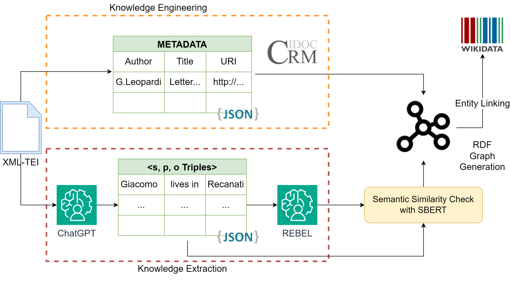

# An Automatically Constructed Knowledge Graph for the Manuscripts of Giacomo Leopardi

This repository contains data and source code for a prototypical Knowledge Extraction application for the 
manuscripts of Leopardi preserved at the [Cambridge University Digital Library](https://cudl.lib.cam.ac.uk/collections/leopardi/1).

The automatically extracted Knowledge Graph is available in this [Turtle File](results/kg_cudl.ttl).

## Pipeline

The Knowledge Graph was extracted by using Babelscape's [REBEL](https://huggingface.co/Babelscape/rebel-large) 
jointly with ChatGPT, which was used to pre-process the Italian text in natural language triples. An illustration of 
our pipeline is presented below.

## About

The source code and data here published are the result of research studies for the digitization project related to the 
manuscripts of Giacomo 
Leopardi and carried out by the National Center of Leopardian Studies and the University of Macerata.

For additional information, you can contact:
- Cristian Santini ([c.santini12@unimc.it]())